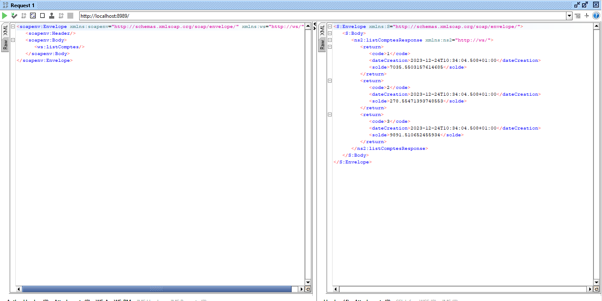

# WebServiceSOAP README

Ce projet **WebServiceSOAP** est une implémentation simple d'un service web SOAP en utilisant Java et JaxWS. Il offre trois fonctionnalités principales : la conversion d'un montant de l'euro en dirhams (DH), la consultation d'un compte, et la consultation d'une liste de comptes.

## Contenu du Projet 

1. **Classes Java:**
    - **Compte.java:** La classe représentant un compte avec des attributs tels que le code, le solde et la date de création.
    - **BanqueApp.java:** La classe principale implémentant les opérations du service web, telles que la conversionEUR_MAD, getCompte et listComptes.
    - **WebServer.java:** La classe pour lancer le serveur JaxWS et publier le service web.

2. **Fichier de Configuration:**
    - **pom.xml:** Le fichier de configuration Maven avec les dépendances nécessaires pour JaxWS.

## Comment Utiliser le Projet

### 1. Construction du Projet
Assurez-vous que vous avez Maven installé.


### 2. Déploiement du Web Service
Exécutez la classe `WebServer.java` pour déployer le service web.
Le serveur sera accessible à l'adresse [http://127.0.0.1:8989/](http://127.0.0.1:8989/).


### 3. Consulter et Analyser le WSDL
Utilisez un navigateur HTTP pour accéder au WSDL généré par le service web.
```bash
http://127.0.0.1:8989/?wsdl
```


### 4. Tester le Web Service
Utilisez un outil comme SoapUI ou Oxygen pour tester les opérations du service web en utilisant le WSDL.

#### 4.1 Créer un Client SOAP Java
  - Générez le Stub à partir du WSDL.
  - Implémentez un client SOAP pour le service web en utilisant le Stub généré.


